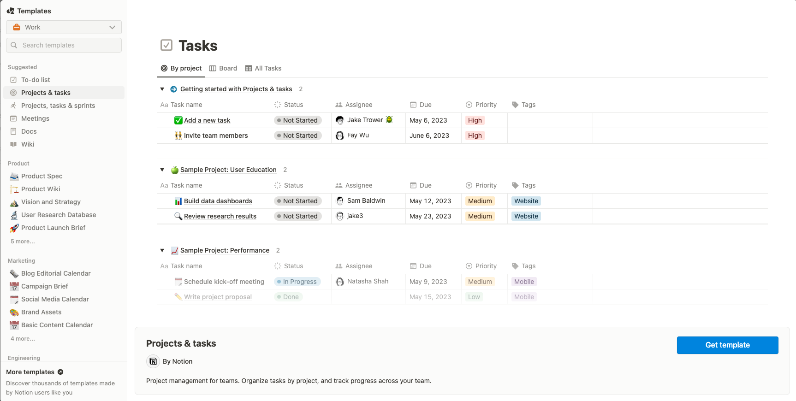

# A Tool to write daily work memo automatically

### Prerequisite
This tool relies on notion to provide MVC workflow; hence it is required to have a prepared notion template.


### Installation
```
// prepare repo
git clone git@github.com:harry83017622/daily-work-memo-by-post-commit-hook.git

pip install pre-commit
pre-commit install --hook-type post-commit
```

### Set Credential
Prepare your notion db ids and integration token. Save it in .notion.env file. For notion developing detail revealing, please check this link https://developers.notion.com/


### How to test
```
// check pre-commit installation
pre-commit --version

// check post-commit
.git/hooks/post-commit
```

### Todo
1. error handling
2. unit test
3. linter
4. ci
